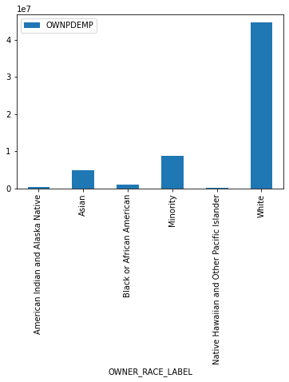
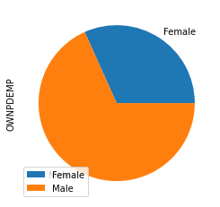

In this code, I am looking at the characteristics of companies, businesses, business owners, and technology use in businesses. 

Unfortunately, without access to the API, it is difficult to interpret the data. For this reason, I focused solely on owners for my two visualizations.

I will create more visualizations once I recieve the API and have more access to searching the dataset.

 

[data](https://www.census.gov/data/developers/data-sets/abs.2019.html)